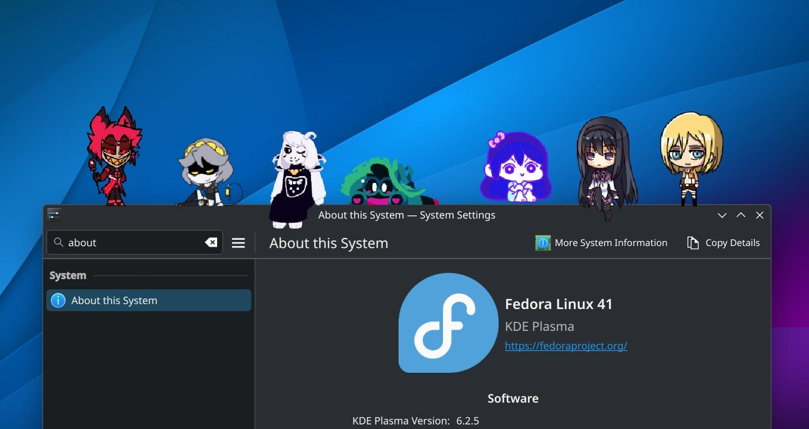

# Shijima-Qt



Cross-platform shimeji desktop pet simulator. Built with Qt6. Supports macOS, Linux and Windows.

- [Download the latest release](https://github.com/pixelomer/Shijima-Qt/releases/latest)
- [See all releases](https://github.com/pixelomer/Shijima-Qt/releases)
- [Report a bug or make a feature request](https://github.com/pixelomer/Shijima-Qt/issues)
- [Shijima homepage](https://getshijima.app)

If you'd like to support the development of Shijima, consider becoming a [sponsor on GitHub](https://github.com/sponsors/pixelomer) or [buy me a coffee](https://buymeacoffee.com/pixelomer).

## Building

If you have any problems with building Shijima-Qt, see the GitHub workflows in this repository.

### macOS

1. Install MacPorts.
2. Install build dependencies.

```bash
sudo port install qt6-qtbase qt6-qtmultimedia pkgconfig libarchive
```

3. Build.

```bash
CONFIG=release make -j8
```

### Linux

```bash
CONFIG=release make -j8
```

### Windows

A Docker image is provided to build Shijima-Qt.

```bash
docker build -t shijima-qt-dev docker-dev
docker run -e CONFIG=release --rm -v "$(pwd)":/work shijima-qt-dev bash -c 'mingw64-make -j8'
```

## Platform Notes

### macOS

Shijima-Qt needs the Accessibility permission to access the frontmost window.

### Linux

Shijima-Qt supports KDE Plasma 6 and GNOME 46 in both Wayland and X11. To get the frontmost window, Shijima-Qt automatically installs and enables a shell plugin when started.  
- On KDE, this is transparent to the user.
- On GNOME, the shell needs to be restarted on the first run. This can be done by logging out and logging back in. Shijima-Qt will exit with an appropriate error message if this is required.
- On other desktop environments, window tracking will not be available.

### Windows

Only tested on Windows 11. May also work on Windows 10. Window tracking is supported and no extra actions should be necessary to run Shijima-Qt.
